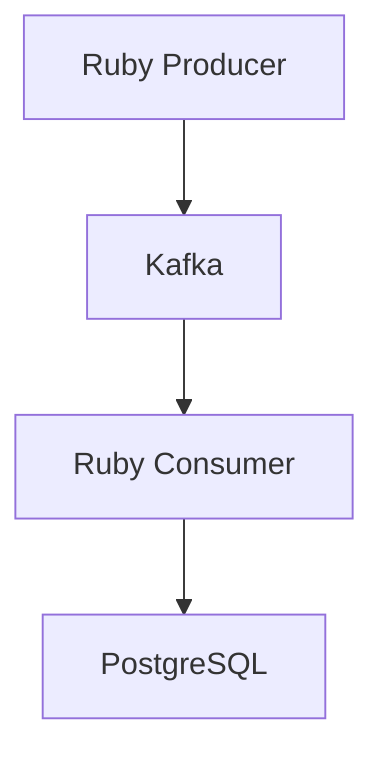

# kakfa-kappa-sample

## Getting started
### run
```
$ docker-compose up -d
```

### produce message
```
$ docker-compose exec ruby-producer ruby producer.rb <YOUR_MESSAGE>
```

### consume message
```
$ docker-compose exec ruby-consumer ruby consumer.rb
```

### view consumed data in DB
```
$ docker-compose exec postgres psql -U admin -d kafka_db -c "select * from messages";
```

### view Kafka messages
access kafka-UI
```
http://localhost:8080
```


## Data flow

