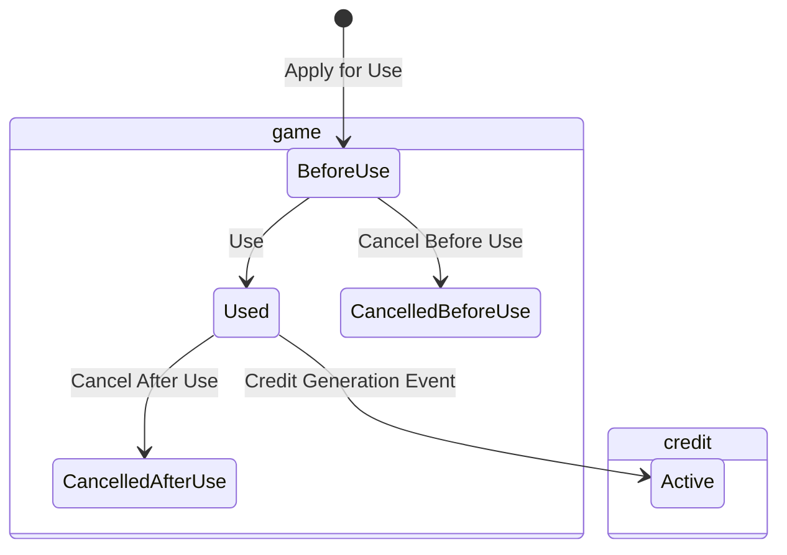

# game accounting sample


## quick start
```
$ make start
$ make monitor
# in other terminal
$ make test
```
You can see the result with sql below:
```sql
select
	ga.id
	, ga.user_id
	, ga.applied_at
	, gu.used_at
	, c.incurred_at
	, gcbu.canceled_at before_cancel_at
	, gcau.canceled_at after_cancel_at
	, *
from
	game_application ga
	left join game_usage gu on ga.id = gu.game_application_id
	left join game_cancel_before_use gcbu on gcbu.game_application_id = ga.id
	left join game_cancel_after_use gcau on gcau.game_application_id = ga.id
	left join credits c on c.game_application_id = ga.id
order by
	ga.applied_at
;

```

## note
next step: 債権系の状態とeventを実装