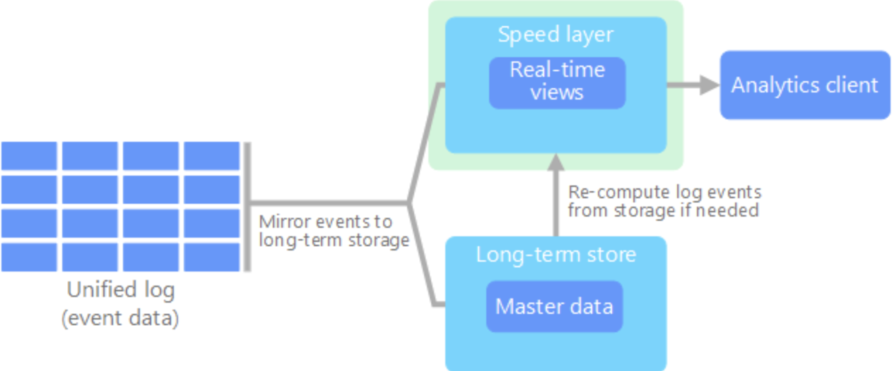
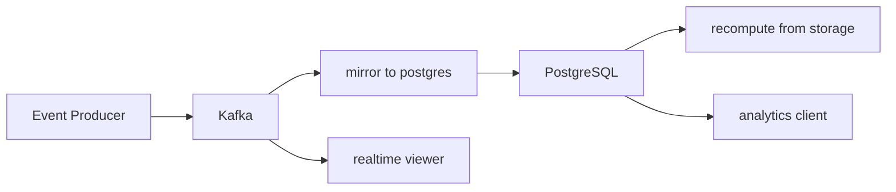

# minimum-kappa-sample

## Referred architecture
  
https://learn.microsoft.com/en-us/azure/architecture/data-guide/big-data/

## Getting started
### run
```
$ docker-compose up -d
```

### mirror kafka topic to postgreSQL DB
```
$  docker-compose exec -d long-term-store ruby mirror_to_postgres.rb
```

### realtime viewer
use 1 active terminal.
```
$ docker-compose exec speed-layer ruby realtime_viewer.rb
```

### produce message
```
$ docker-compose exec event-producer ruby producer.rb <SOME_NUMBER>
```
you can see message in realtime viewer


### analytics
see total raw count.  
```
$ docker-compose exec analytics-client ruby analytics_client.rb
```
### recompute DB data
see the sum of message values
```
$ docker-compose exec speed-layer ruby recompute_from_storage.rb
```

### view consumed data in DB
```
$ docker-compose exec postgres psql -U admin -d kafka_db -c "select * from messages";
```

### view Kafka messages
access kafka-UI
```
http://localhost:8080
```


## Data flow



## Tips
### when update init.sql
reset db volume and run again
```
$ docker-compose down -v
```